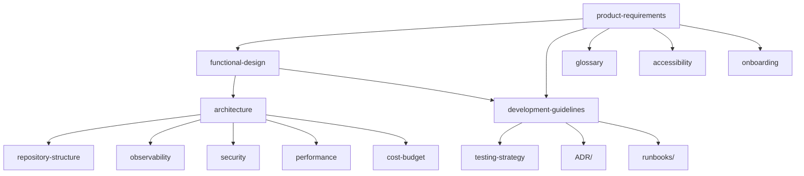

# docs/ — 永続的ドキュメント

このディレクトリはプロジェクトの**北極星**。基本設計が変わらない限り更新されない。

## 構造

| ファイル | 役割 | 埋める順番 |
|---|---|---|
| [`product-requirements.md`](./product-requirements.md) | 何を作るか（ビジョン、ユーザー、機能要件、非機能要件） | 1 |
| [`functional-design.md`](./functional-design.md) | 機能の設計（アーキテクチャ、データモデル、図） | 2 |
| [`architecture.md`](./architecture.md) | 技術選定（スタック、ツール、制約） | 3 |
| [`repository-structure.md`](./repository-structure.md) | フォルダ・ファイル配置ルール | 4 |
| [`development-guidelines.md`](./development-guidelines.md) | プロジェクト固有の開発ルール | 5 |
| [`glossary.md`](./glossary.md) | ユビキタス言語・命名規則 | 6 |
| [`testing-strategy.md`](./testing-strategy.md) | テスト戦略（unit/integration/e2e） | 必要時 |
| [`observability.md`](./observability.md) | ログ/メトリクス/トレース | 必要時 |
| [`security.md`](./security.md) | 脅威モデル STRIDE、認証/認可方針 | 必要時 |
| [`performance.md`](./performance.md) | Core Web Vitals 目標 | 必要時 |
| [`accessibility.md`](./accessibility.md) | WCAG 2.2 AA 準拠戦略 | 必要時 |
| [`cost-budget.md`](./cost-budget.md) | LLM/インフラコスト予算 | 必要時 |
| [`onboarding.md`](./onboarding.md) | 新規参画者向け（人間 + Claude） | 必要時 |
| [`ADR/`](./ADR/) | Architecture Decision Records | 重要決定時 |
| [`runbooks/`](./runbooks/) | 運用 runbook（deploy/incident/rollback） | 運用前 |

## 原則

- **永続的（北極星）** — 基本設計の単一情報源
- **一時的（`.steering/`）と分離** — 「今回の」は `.steering/` へ
- **1 ファイル毎承認ゲート** — 生成スキルが複数ファイル一気に書こうとしても 1 個ずつ承認
- **Mermaid 優先** — 図表はコードブロックで埋め込み、独立フォルダ作らない
- **更新規律** — 設計変更時はこの docs/ も同時更新する。コードと docs の乖離を防ぐ

## ナビゲーション

