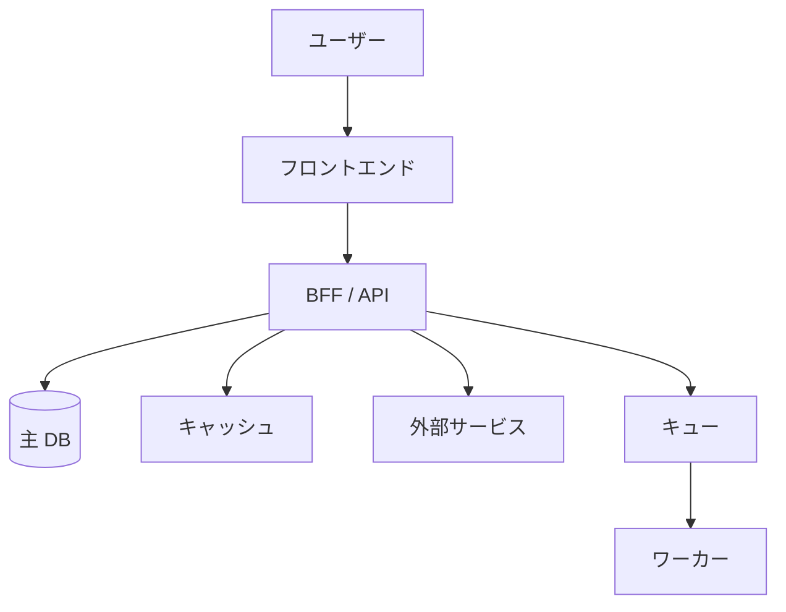
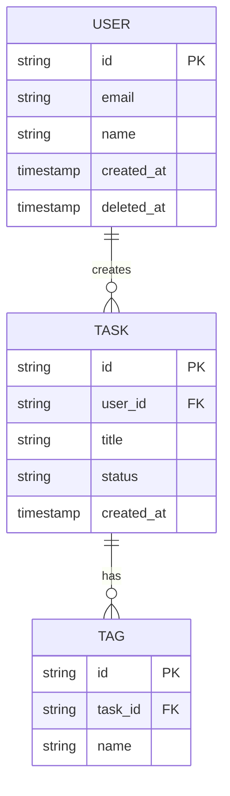
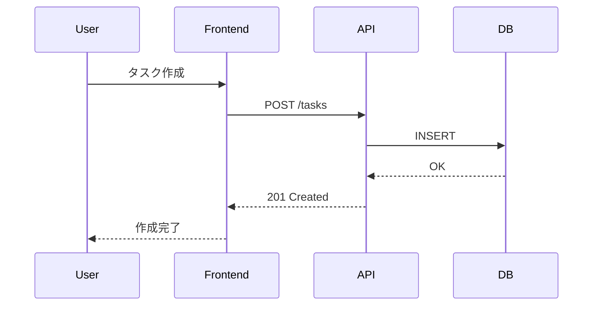
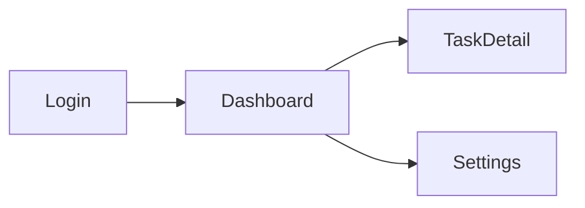

# 機能設計書

## 全体アーキテクチャ

{システム全体の構造を 1 段落で記述}

### システム構成図



## データモデル

### ER 図



### エンティティ定義

#### {エンティティ名}

| フィールド | 型 | 必須 | 説明 |
|---|---|---|---|
| id | string | ✓ | 主キー（ULID） |
| created_at | timestamp | ✓ | 作成日時（UTC） |

## コンポーネント設計

### {主要コンポーネント 1}

- **責務**: {何をするか}
- **インターフェース**: {入出力契約}
- **依存**: {依存するコンポーネント}

## ユースケース

### UC-001: {ユースケース名}

**アクター**: {誰が}
**前提**: {開始条件}
**基本フロー**:
1. ユーザーが X をする
2. システムが Y をする
3. ユーザーに Z を表示

**代替フロー**: {エラーケース等}



## 画面遷移



## API 設計

### エンドポイント一覧

| メソッド | パス | 説明 | 認証 | レート制限 |
|---|---|---|---|---|
| GET | `/api/tasks` | タスク一覧 | 必要 | 100 req/min |
| POST | `/api/tasks` | タスク作成 | 必要 | 30 req/min |
| GET | `/api/tasks/:id` | タスク詳細 | 必要 | 100 req/min |
| PATCH | `/api/tasks/:id` | タスク更新 | 必要 | 30 req/min |
| DELETE | `/api/tasks/:id` | タスク削除 | 必要 | 30 req/min |

### API レスポンス共通形式

```json
{
  "success": true,
  "data": { /* ... */ },
  "error": null,
  "meta": {
    "page": 1,
    "limit": 20,
    "total": 100
  }
}
```

エラー時:
```json
{
  "success": false,
  "data": null,
  "error": {
    "code": "VALIDATION_ERROR",
    "message": "title is required",
    "details": [ /* ... */ ]
  }
}
```

## 状態管理

| 状態種別 | 保持場所 | 例 |
|---|---|---|
| サーバー状態 | TanStack Query / SWR | API レスポンス |
| クライアント状態 | Zustand / Jotai | UI モーダル開閉 |
| URL 状態 | search params / route segments | フィルタ、ページ |
| フォーム状態 | React Hook Form | 入力値、バリデーション |

## エラーハンドリング

| エラー種別 | 扱い方 |
|---|---|
| バリデーション | フィールド横にインライン表示 |
| 認証 | ログイン画面へリダイレクト |
| 認可 | 403 ページ |
| ネットワーク | 自動リトライ（3 回）+ トースト |
| サーバー（5xx） | エラーページ + Sentry 送信 |
| 楽観的更新失敗 | 元の状態に戻す + トースト |
