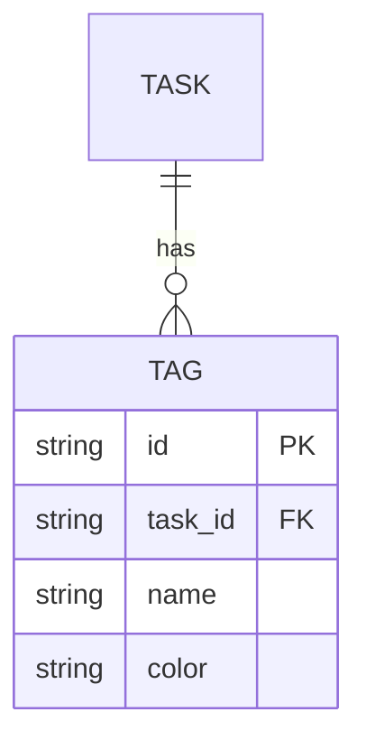

# 設計: {タイトル}

## アプローチ

選んだ方針を 1 段落で。

## 設計

### データモデル変更

### API 変更

| メソッド | パス | 説明 |
|---|---|---|
| GET | `/api/tasks?tags=foo,bar` | tag フィルタ追加 |
| POST | `/api/tasks/:id/tags` | タグ追加 |
| DELETE | `/api/tasks/:id/tags/:tagId` | タグ削除 |

### UI 変更

- タスク詳細画面にタグ表示エリア
- タスク一覧画面に tag フィルタ

### コンポーネント

- `TagBadge` — タグ表示
- `TagInput` — タグ入力（autocomplete）
- `TagFilter` — 一覧画面のフィルタ

## 検討した代替案

### Option A: {採用}

理由: 

### Option B: {不採用}

却下理由: 

## 影響範囲

- DB マイグレーション必要 → backward-compatible
- API breaking change なし
- UI 既存画面の改修あり

## テスト戦略

- Unit: tag 関連 utility, hook
- Integration: API + DB
- E2E: タスク作成 → タグ付け → フィルタ検索

## 段階リリース

- [ ] 内部テスト（feature flag off）
- [ ] beta（10% ユーザー）
- [ ] GA

## 計測

- タグ作成数 / 1 ユーザー
- フィルタ使用率
- p95 レイテンシ
